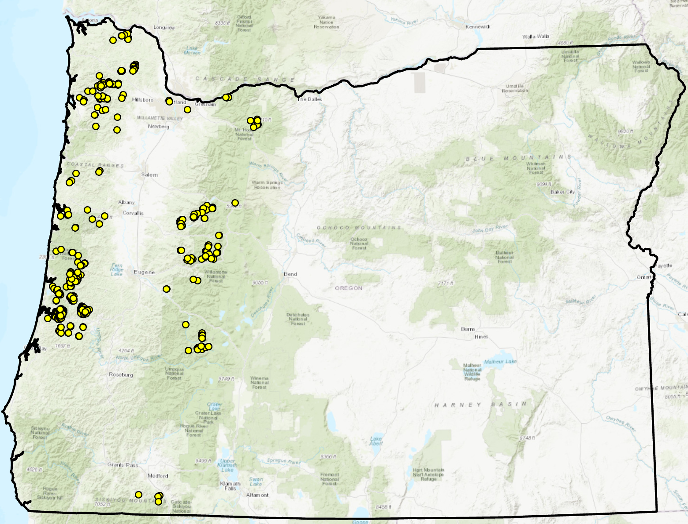

```{r setup, include = FALSE}
knitr::opts_chunk$set(
  collapse = TRUE,
  comment = "#>",
  error = FALSE
)
```

```{r load, include = FALSE}
library(TerrainWorksUtils)
library(terra)
library(stringr)
library(shiny)
library(car)
```

This document describes the steps for building and evaluating (a little bit) training data for a landslide susceptibility model. The code chunks here borrow from the .Rmd files Julia wrote. The focus is on developing methods for updating the landslide initiation and runout models used for the Private Forest Accord. I will use the landslide inventory published by [DOGAMI](https://www.oregongeology.org/) in [Special Paper 53](https://www.oregongeology.org/pubs/sp/SP-53/p-SP-53.htm). This inventory focused on landslides that triggered debris flows and includes two vector GIS layers: a point feature class indicating the initiation site and a line feature class delineating the extent of debris flow runout. I'll cover initiation and runout separately because they rely on two different modeling strategies, starting below with initiation.

This document uses data files available on a TerrainWorks sharefile site [here](https://terrainworks.sharefile.com/d-s85152bd55a3b42a6b0df7e304eaaa991). These come as a zip archive. Unzip to c:/tempDir/extdata/in; that's the default location. You can specify a different directory using the data_dir parameter when rendering this document. Likewise, files created here are written to the output directory, the default of which is c:/tempDir/out. This may be changed using the output_dir parameter when rendering.

# Landslide Initiation

## Covariates

I want to limit our set of candidate explanatory variables to those that slope-stability theory leads us to expect provide the greatest explanatory power. Taking the simplest option, the infinite slope approximation [e.g., @RN4001], these include slope gradient, soil depth, and saturation depth. We also need soil geotechnical properties (bulk density, etc.), but for now we'll assume these are uniform and focus on what we can infer from topography. Soil depth may be proportional to surface curvature and saturation depth to contributing area. Hence, we'll use gradient, mean curvature, and partial contributing area (the contributing area for a storm of fixed duration). We must select a length scale over which gradient, curvature, and aspect (used for calculating contributing area) are measured. I've been using a radius of 15 meters, giving a measuring length scale of 30 meters. More on this later.

These attributes are calculated using the elev_deriv function in this package. Created rasters are written by default to c:/tempDir/out, but you can change this. This example uses a DEM for the Big Creek Smith HUC 12 from the Umpqua basin. See the data files you downloaded for other examples. All the DEM names start with "elev_".

```{r shaded_relief}
DEM <- paste0(params$data_dir, params$dem_name)

initiation_points <- terra::vect(paste0(params$data_dir, params$landslide_points, ".shp"))

elev <- terra::rast(DEM)

elev <- terra::clamp(elev,
                     lower = 0.00001,
                     upper = 99999.,
                     values = FALSE)

# slope and aspect are used by terra::shade to create a shaded relief map
slope <- terra::terrain(elev,
                        "slope",
                        unit = "radians")

aspect <- terra::terrain(elev,
                         "aspect",
                         unit = "radians")

elev_shade <- terra::shade(slope,
                           aspect,
                           angle = 45,
                           direction = 315)

plot(elev,
     col = topo.colors(255, alpha = 1.0),
     main = params$huc12_name,
     plg = list(title = "Elevation (m)"),
     alpha = 1.0)

plot(elev_shade,
     col = grey(1:100/100),
     legend = FALSE,
     alpha = 0.5,
     add = TRUE)

plot(initiation_points,
     add = TRUE)

```

Here's code to create the covariate rasters. This is working with a single DEM file. The PFA_Sampling_Multiple_DEMs.Rmd markdown document shows how to translate this to muliple DEMs.

```{r elevation_derivatives}
output_dir <- params$output_dir

if (!dir.exists(output_dir)) {
  dir.create(output_dir)
}

length_scale = params$length_scale # Default is a 15-meter length scale (7.5-meter radius) for calculating derivatives.

# These are the output rasters we want to create; gradient and mean curvature ((tangential + slope normal)/2).
rasters <- c(paste0("GRADIENT,", output_dir, "gradient"),
             paste0("MEAN CURVATURE,", output_dir, "mean_curv"))

# elev_deriv creates these rasters and places them in the output_dir.
if (file.exists(paste0(output_dir, "gradient.flt")) & file.exists(paste0(output_dir, "mean_curv.flt"))) {
  grad <- rast(paste0(output_dir, "gradient.flt"))
  mean_curv <- rast(paste0(output_dir, "mean_curv.flt"))
  mask_rasters <- c(grad, mean_curv)

  } else {
 
  elev_deriv(rasters = rasters,
             length_scale = length_scale,
             dem = DEM,
             scratch_dir = output_dir)

  mask_rasters <- rast(paste0(output_dir, "gradient.flt"))
  mask_rasters <- c(mask_rasters, paste0(output_dir, "mean_curv.flt"))
}
covariates <- mask_rasters

# Get the partial contributing areas
duration_list <- params$duration_list
if (file.exists(params$duration_list)) {
  durations <- read.csv(duration_list, header = FALSE)
} else {
  durations <- c(5, 10, 20, 40)
}

k = 1.0 # saturated hydraulic conductivity in meters per hour

for (d in durations) {
  raster_name <- paste0(output_dir, "pca_k1_", as.character(d))
  if (file.exists(paste0(raster_name, ".flt"))) {
    covariates <- c(covariates, rast(paste0(raster_name, ".flt")))
  } else {
    covariates <- c(covariates, contributing_area(raster = raster_name,
                    dem = DEM, 
                    length_scale = length_scale, 
                    k = k, 
                    d = d, 
                    scratch_dir = output_dir))
  }
}

# Get the raster values at each initiation site
ls_pnts <- extract(covariates, initiation_points, method = "bilinear")
```
## Sampling
Below is the distribution of landslide sites in the DOGAMI inventory across Oregon. As you can see, these are scattered in clumps over a broad range of western Oregon.

{width="500px"}

The inventory was focused on landslides with debris-flow runout and the sites were selected from several different studies. Hence, this is not a census of landslides within some well-defined boundary for which landslide density can be defined. This presents a dilemma, because we use landslide density as a measure of susceptibility. 

### Constraining the sampling area: buffer initiation points
To deal with the unconstrained boundary for this landslide inventory, I employ a strategy described by Zhu et al. [-@RN4226] (see also @RN4224). Place a buffer of specified radius around each initiation point. This represents the area within which the landslide initiation occurred and will be excluded from the area available for sampling nonlandslide points. Then place a second, larger buffer around the point. This represents the area within which we can be (fairly) confident that no other landslides were observed, or they would have been included in the DOGAMI inventory. The zone between the two circular buffers then serves as the area of no landslide occurrence (in the inventory) from which to sample nonlandslide points for training a model.

```{r limit_analysis_area}

# In the call to create_analysis_region_mask I use a very large expansion_factor here so that all (most?) of the DEM is included.
# Recall, mask_rasters contains the gradient and mean curvature rasters calculated above.
analysis_mask <- create_analysis_region_mask(raster = covariates, 
                                             points = initiation_points,
                                             mask_vars = c("gradient", "mean_curv"),
                                             expansion_factor = 100.)

neg_region <- make_neg_region(initiation_points, 
                              covariates, 
                              inner_buffer = params$inner_buffer, 
                              outer_buffer = params$outer_buffer,
                              return_raster = TRUE)

final_mask <- analysis_mask * neg_region

plot(elev_shade,
     col = grey(1:100/100),
     ext = terra::ext(initiation_points))

plot(final_mask,
     col = rgb(1,0,0,0.5),
     add = TRUE)

plot(initiation_points,
     add = TRUE)

covariatess <- covariates * final_mask

```
### Constraining the sampling area: exclude values outside landslide range
To further constrain the area of nonlandslide terrain from which to sample training points, we can restrict the sample area to that falling within the range of observed values of any immutable explanatory variables within which landslides were observed. Zones outside of this range should get a modeled probability of landslide occurrence of zero; we can simply set the probability within those zones to zero and focus the sampling scheme within the zone where landslide probability is greater than zero. This constraint applies only for attributes that don't change over the time scales of interest. For the list of candidate explanatory variables presented, these are gradient and curvature. The partial contributing areas depend on the storm duration.

Here are density plots comparing gradient and cuvature values over the analysis area to those at the landslide initiation points.

```{r check_out_grad}
ls_grad_den <- density(ls_pnts$gradient)

# We're not really interested in cliffs, so let's clamp gradient values to a maximum of 150%
covariates$gradient <- terra::clamp(covariates$gradient,
                         lower = 0.,
                         upper = 1.5,
                         values = FALSE) # set anything greater than 1.5 to NA

par(mfrow = c(1, 2))

density_grad <- density(covariates$gradient, plot = FALSE)
ymax <- max(max(density_grad[[1]]$y), max(ls_grad_den$y))

density(covariates$gradient,
        col = "black",
        lwd = 2,
        ylim = c(0., ymax),
        main = params$huc12_name,
        xlab = "Gradient")

lines(ls_grad_den,
      lwd = 2,
      col = "red")

legend(x = "topleft",
       legend = c("Nonlandslide", "Landslide"),
       lty = c(1,1),
       col = c("black", "red"),
       lwd = 2,
       bty = "n",
       cex = 0.7,)

ls_mean_den <- density(ls_pnts$mean_curv)

density_mean <- density(covariates$mean_curv, plot = FALSE)
ymax <- max(max(density_mean[[1]]$y), max(ls_mean_den$y))

density(covariates$mean_curv,
        col = "black",
        lwd = 2,
        ylim = c(0., ymax),
        main = params$huc12_name,
        xlab = "Mean Curvature")

lines(ls_mean_den,
      lwd = 2,
      col = "red")

legend(x = "topright",
       legend = c("Nonlandslide", "Landslide"),
       lty = c(1,1),
       col = c("black", "red"),
       lwd = 2,
       cex = 0.7,
       bty = "n")
```
The smallest landslide-initiation-point gradient is `r min(ls_pnts$gradient)` and the largest value is `r max(ls_pnts$gradient)`. Landslides tend to initiate on steeper ground and a substantial portion of the analysis area has gradients less than the smallest value associated with a landslide initiation point. These areas may include ridge tops, valley floors, and lower-gradient hillslopes. Likewise, some small portion of the analysis area has gradients greater than the largest initiation-point value. These may include cliffs and rocky slopes too steep to accumulate soil. 

The smallest mean curvature value is `r min(ls_pnts$mean_curv)` and the largest value is `r max(ls_pnts$mean_curv)`. Landslides tend to occur in topographically convergent zones (which I've calculated as positive here) indicated by the slight offset of the initiation-point curve from the analysis-area curve. The differences are more subtle than seen with gradient, but there are still some small portion of the analysis area with curvature less than the initiation-point minimum and greater than the initiation-point maximum.

Here is how gradient and mean curvature of the landslide points are correlated through this range:
```{r plot_mean_vs_gradient}
scatterplot(ls_pnts$mean_curv ~ ls_pnts$gradient)
```
If these variables were highly correlated for the initiation sites, it could be worthwhile to define new variable values using a rotated data space. That would better delineate those areas with and without landslides. However, the correlation is slight and the scatter large, so that doesn't look worth the effort here.

Let's look at how gradient values compare between the analysis area and the initiation points just for those areas where the DEM gradient and mean-curvature values fall within the range of initiation-point values.

``` {r mask_rasters}

# Now use a much tighter expansion_factor.
analysis_mask <- create_analysis_region_mask(raster = covariates, 
                                             points = initiation_points,
                                             mask_vars = c("gradient", "mean_curv"),
                                             expansion_factor = 1.1)

final_mask <- analysis_mask * neg_region
covariates <- covariates * final_mask

plot(elev_shade,
     col = grey(1:100/100),
     ext = terra::ext(initiation_points))

plot(final_mask,
     col = rgb(1,0,0,0.5),
     add = TRUE)

plot(initiation_points,
     add = TRUE)

```

```{r gradient_limits}
par(mfrow = c(1, 2))

density_grad <- density(covariates$gradient, plot = FALSE)
ymax <- max(max(density_grad[[1]]$y), max(ls_grad_den$y))
density(covariates$gradient,
        col = "black",
        lwd = 2,
        ylim = c(0., ymax),
        main = "Masked analysis area",
        xlab = "Gradient")

lines(ls_grad_den,
      lwd = 2,
      col = "red")

legend(x = "topleft",
       legend = c("Nonlandslide", "Landslide"),
       lty = c(1,1),
       col = c("black", "red"),
       lwd = 2,
       cex = 0.7,
       bty = "n")

density_mean <- density(covariates$mean_curv, plot = FALSE)
ymax = max(max(density_mean[[1]]$y), max(ls_mean_den$y))
density(covariates$mean_curv,
        col = "black",
        lwd = 2,
        ylim = c(0., ymax),
        xlab = "Mean Curvature",
        main = "Masked analysis area")

lines(ls_mean_den,
      lwd = 2,
      col = "red")

legend(x = "topright",
       legend = c("Nonlandslide", "Landslide"),
       lty = c(1,1),
       col = c("black", "red"),
       lwd = 2,
       cex = 0.7,
       bty = "n")
```
Although constrained to the same range, the distribution of values is distinclty (I hope) different for the entire analysis area than for the initiation sites. We can focus model calibration over this range.

Now to sample nonlandslide points from the analysis region. 
```{r nonlandslide_points}
num_points <- ceiling(length(initiation_points))

nonlandslide <- sample_points(count = num_points,
                          region = final_mask,
                          buffer = FALSE,
                          rseed = 12)

plot(elev_shade,
     col = grey(1:100/100),
     ext = ext(initiation_points))

plot(final_mask,
     col = rgb(1,0,0,0.5),
     add = TRUE)

plot(nonlandslide,
     col = "black",
     add = TRUE)

```
Compare the non-landslide sample to the analysis area and the landslide initiation points.

```{r compare}
par(mfrow = c(1, 2))

nonls_pnts <- extract(covariates,
                      nonlandslide,
                      method = "bilinear")

nonls_grad_den <- density(nonls_pnts$gradient)

density_grad <- density(covariates$gradient, plot = FALSE)

ymax <- max(max(density_grad[[1]]$y), max(nonls_grad_den$y), max(ls_grad_den$y))

density(covariates$gradient,
        col = "black",
        lwd = 2,
        ylim = c(0., ymax),
        main = params$huc12_name,
        xlab = "Gradient")

lines(nonls_grad_den,
      lwd = 2,
      col = "blue")

lines(ls_grad_den,
      lwd = 2,
      col = "red")

legend(x = "topleft",
       legend = c("Nonlanslide Area", "Nonlandslide Points", "Landslide Points"),
       lty = c(1,1,1),
       col = c("black", "blue", "red"),
       lwd = 2,
       cex = 0.7,
       bty = "n")

nonls_mean_den <- density(nonls_pnts$mean_curv)

density_mean <- density(covariates$mean_curv, plot = FALSE)

ymax <- max(max(density_mean[[1]]$y), max(nonls_mean_den$y), max(ls_mean_den$y))

density(covariates$mean_curv,
        col = "black",
        lwd = 2,
        ylim = c(0., ymax),
        main = params$huc12_name,
        xlab = "Mean Curvature")

lines(nonls_mean_den,
      lwd = 2,
      col = "blue")

lines(ls_mean_den,
      lwd = 2,
      col = "red")

legend(x = "topright",
       legend = c("Nonlanslide Area", "Nonlandslide Points", "Landslide Points"),
       lty = c(1,1,1), 
       col = c("black", "blue", "red"),
       lwd = 2,
       cex = 0.7,
       bty = "n")

```
Now compare partial contributing areas between the masked analysis region and the landslide initiation points.

```{r partial_area_plots, fig.show = "hold"}
num_d = length(durations)
par(mfrow = c(ceiling(num_d / 2), 2))

for (i in 1:num_d) {

  d <- durations[[i]]
  raster_name <- paste0("covariates$pca_k1_", as.character(d))
  this_col <- 3 + i
  vals <- data.frame(ls_pnts[this_col])
  ls_den <- density(vals[[1]])
  vals <- data.frame(nonls_pnts[this_col])
  nonls_den <- density(vals[[1]])

  area_den <- density(subset(covariates, 2 + i), plot = FALSE)
  ymax = max(max(area_den[[1]]$y), max(ls_den$y), max(nonls_den$y))

  terra::density(subset(covariates, 2 + i),
          col = "black",
          ylim = c(0., ymax),
          lwd = 2,
          main = paste0(d, "-hr duration"),
          xlab = "Number of DEM cells")

  lines(nonls_den,
        lwd = 2,
        col = "blue")

  lines(ls_den,
        lwd = 2,
        col = "red")

  legend(x = "topleft",
         cex = 0.7,
         legend = c("Area", "Sample", "Landslide"),
         lty = c(1,1,1),
         col = c("black", "blue", "red"),
         lwd = 2,
         bty = "n")

}
```

As the storm duration increases, the partial contributing area values within the masked analysis region become more tightly grouped and, for each case, the landslide points are offset to higher contributing areas than the analysis area. At least that is the case for the Big Creek Smith HUC12; results might vary for different regions and different sets of landslide initiation points.

### Sample density
The sampled non-landslide points characterize covariate values across the analysis region. Within any increment of covariate space, the density of landslide points (number per unit area or area of initiating zones per unit area) provides a relative measure of susceptibility. It is this proportion of landslide occurrence to analysis area as a function of the covariate values that statistical models use to estimate probability of encountering an initiation site. We therefore want the sampled non-landslide points to provide a good characterization of the set of covariate values found within the analysis area. The relative densities will depend on the balance of the sample - the number of initiation points relative to the number of sample points. In these examples, the number of non-landslide points equals the number of landslide points. Comparing the black and blue lines shows how well the sampled non-landslide points represent the analysis area. These don't look terrible, but What happens if we use a different random sample of points or increase the number of non-landslide points?

Let's try a different random seed. We initially obtained the current sample points in chunk "nonlandslide_points". It's copied here, but with a different seed:

```{r nonlandslide_points_again}
par(mfrow = c(1, 2))

nonlandslide2 <- sample_points(count = num_points,
                          region = final_mask,
                          buffer = FALSE,
                          rseed = 120)

nonls_pnts2 <- extract(covariates,
                       nonlandslide2,
                       method = "bilinear")

nonls_grad_den2 <- density(nonls_pnts2$gradient)

nonlandslide3 <- sample_points(count = num_points,
                               region = final_mask,
                               buffer = FALSE,
                               rseed = 240)

nonls_pnts3 <- extract(covariates,
                       nonlandslide3,
                       method = "bilinear")

nonls_grad_den3 <- density(nonls_pnts3$gradient)

density_grad <- density(covariates$gradient, plot = FALSE)
ymax = max(max(density_grad[[1]]$y), 
           max(nonls_grad_den$y), 
           max(nonls_grad_den2$y),
           max(nonls_grad_den3$y),
           max(ls_grad_den$y))

density(covariates$gradient,
        col = "black",
        lwd = 3,
        ylim = c(0., ymax),
        main = "New random seeds",
        xlab = "Gradient",
        lty = 1)

lines(nonls_grad_den,
      lwd = 2,
      col = "blue",
      lty = 1)

lines(nonls_grad_den2,
      lwd = 2,
      col = "blue",
      lty = 2)

lines(nonls_grad_den3,
      lwd = 2,
      col = "blue",
      lty = 3)

lines(ls_grad_den,
      lwd = 3,
      col = "red",
      lty = 1)

legend(x = "topright",
       legend = c("Area", "Seed 1", "Seed 2", "Seed 3", "Landslide"),
       lty = c(1,1,2,3,1),
       col = c("black", "blue", "blue", "blue", "red"),
       lwd = c(3, 2, 2, 2, 3),
       cex = 0.7,
       bty = "n")

num_points <- 2 * num_points

nonlandslide1 <- sample_points(count = num_points,
                               region = final_mask,
                               buffer = FALSE,
                               rseed = 12)

nonls_pnts1 <- extract(covariates,
                       nonlandslide1,
                       method = "bilinear")

nonls_grad_den1 <- density(nonls_pnts1$gradient)

nonlandslide2 <- sample_points(count = num_points,
                          region = final_mask,
                          buffer = FALSE,
                          rseed = 120)

nonls_pnts2 <- extract(covariates,
                       nonlandslide2,
                       method = "bilinear")

nonls_grad_den2 <- density(nonls_pnts2$gradient)

nonlandslide3 <- sample_points(count = num_points,
                               region = final_mask,
                               buffer = FALSE,
                               rseed = 240)

nonls_pnts3 <- extract(covariates,
                       nonlandslide3,
                       method = "bilinear")

nonls_grad_den3 <- density(nonls_pnts3$gradient)

density_grad <- density(covariates$gradient, plot = FALSE)
ymax = max(max(density_grad[[1]]$y), 
           max(nonls_grad_den1$y), 
           max(nonls_grad_den2$y),
           max(nonls_grad_den3$y),
           max(ls_grad_den$y))

density(covariates$gradient,
        col = "black",
        lwd = 3,
        ylim = c(0., ymax),
        main = "Doubled points",
        xlab = "Gradient",
        lty = 1)

lines(nonls_grad_den1,
      lwd = 2,
      col = "blue",
      lty = 1)

lines(nonls_grad_den2,
      lwd = 2,
      col = "blue",
      lty = 2)

lines(nonls_grad_den3,
      lwd = 2,
      col = "blue",
      lty = 3)

lines(ls_grad_den,
      lwd = 3,
      col = "red",
      lty = 1)

legend(x = "topright",
       legend = c("Area", "Seed 1", "Seed 2", "Seed 3", "Landslide"),
       lty = c(1,1,2,3,1),
       col = c("black", "blue", "blue", "blue", "red"),
       lwd = c(3, 2, 2, 2, 3),
       cex = 0.7,
       bty = "n")
```
OK, that's a bit unnerving. Let's try doubling the number of sample points again.
```{r}
par(mfrow = c(1, 2))

nonlandslide1 <- sample_points(count = num_points,
                               region = final_mask,
                               buffer = FALSE,
                               rseed = 12)

nonls_pnts1 <- extract(covariates,
                       nonlandslide1,
                       method = "bilinear")

nonls_grad_den1 <- density(nonls_pnts1$gradient)

nonlandslide2 <- sample_points(count = num_points,
                          region = final_mask,
                          buffer = FALSE,
                          rseed = 120)

nonls_pnts2 <- extract(covariates,
                       nonlandslide2,
                       method = "bilinear")

nonls_grad_den2 <- density(nonls_pnts2$gradient)

nonlandslide3 <- sample_points(count = num_points,
                               region = final_mask,
                               buffer = FALSE,
                               rseed = 240)

nonls_pnts3 <- extract(covariates,
                       nonlandslide3,
                       method = "bilinear")

nonls_grad_den3 <- density(nonls_pnts3$gradient)

density_grad <- density(covariates$gradient, plot = FALSE)
ymax = max(max(density_grad[[1]]$y), 
           max(nonls_grad_den1$y), 
           max(nonls_grad_den2$y),
           max(nonls_grad_den3$y),
           max(ls_grad_den$y))

density(covariates$gradient,
        col = "black",
        lwd = 3,
        ylim = c(0., ymax),
        main = "Doubled points",
        xlab = "Gradient",
        lty = 1)

lines(nonls_grad_den1,
      lwd = 2,
      col = "blue",
      lty = 1)

lines(nonls_grad_den2,
      lwd = 2,
      col = "blue",
      lty = 2)

lines(nonls_grad_den3,
      lwd = 2,
      col = "blue",
      lty = 3)

lines(ls_grad_den,
      lwd = 3,
      col = "red",
      lty = 1)

legend(x = "topright",
       legend = c("Area", "Seed 1", "Seed 2", "Seed 3", "Landslide"),
       lty = c(1,1,2,3,1),
       col = c("black", "blue", "blue", "blue", "red"),
       lwd = c(3, 2, 2, 2, 3),
       cex = 0.7,
       bty = "n")

num_points <- 2 * num_points

nonlandslide1 <- sample_points(count = num_points,
                               region = final_mask,
                               buffer = FALSE,
                               rseed = 12)

nonls_pnts1 <- extract(covariates,
                       nonlandslide1,
                       method = "bilinear")

nonls_grad_den1 <- density(nonls_pnts1$gradient)

nonlandslide2 <- sample_points(count = num_points,
                          region = final_mask,
                          buffer = FALSE,
                          rseed = 120)

nonls_pnts2 <- extract(covariates,
                       nonlandslide2,
                       method = "bilinear")

nonls_grad_den2 <- density(nonls_pnts2$gradient)

nonlandslide3 <- sample_points(count = num_points,
                               region = final_mask,
                               buffer = FALSE,
                               rseed = 240)

nonls_pnts3 <- extract(covariates,
                       nonlandslide3,
                       method = "bilinear")

nonls_grad_den3 <- density(nonls_pnts3$gradient)

density_grad <- density(covariates$gradient, plot = FALSE)
ymax = max(max(density_grad[[1]]$y), 
           max(nonls_grad_den1$y), 
           max(nonls_grad_den2$y),
           max(nonls_grad_den3$y),
           max(ls_grad_den$y))

density(covariates$gradient,
        col = "black",
        lwd = 3,
        ylim = c(0., ymax),
        main = "Quadrupled points",
        xlab = "Gradient",
        lty = 1)

lines(nonls_grad_den1,
      lwd = 2,
      col = "blue",
      lty = 1)

lines(nonls_grad_den2,
      lwd = 2,
      col = "blue",
      lty = 2)

lines(nonls_grad_den3,
      lwd = 2,
      col = "blue",
      lty = 3)

lines(ls_grad_den,
      lwd = 3,
      col = "red",
      lty = 1)

legend(x = "topright",
       legend = c("Area", "Seed 1", "Seed 2", "Seed 3", "Landslide"),
       lty = c(1,1,2,3,1),
       col = c("black", "blue", "blue", "blue", "red"),
       lwd = c(3, 2, 2, 2, 3),
       cex = 0.7,
       bty = "n")
```
More points provides a better representation, but we'll probably never get a perfect representation of the covariate distribution using a finite sample. This will probably get worse with partial contributing areas, because the high values become increasingly concentrated with larger storm durations. When the time comes, here's another strategy to try, based on a methodology described in [Halibisky et al. (2022)](https://egusphere.copernicus.org/preprints/2022/egusphere-2022-665/). Build an initial model using a random spatial sample of points. Then stratify on the modeled probability to obtain a new sample. We can do this by using a uniform random sample on the cumulative distribution of modeled probability. 

I am unsure about the sample balance to aim for. We'll ultimately base susceptibility on proportions, which removes dependence on absolute density (probability), but larger values (e.g., from a balanced sample) will probably reduce rounding error and provide better results. Except that smaller samples produce greater variability in modeled probability. 

On to multiple DEMs.
